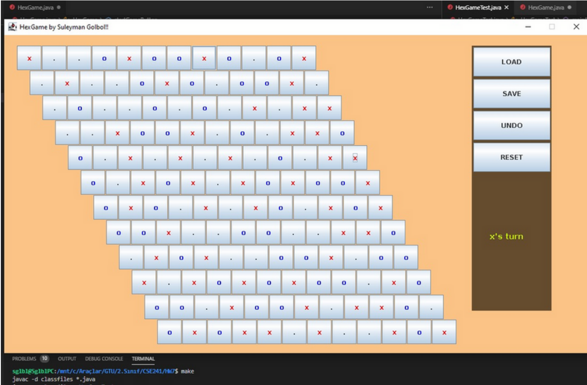

# Hex-Game-for-PC

## Java Hex Game GUI is as following
It uses grid layout
It uses JBottons for each cell.
It has Radio and Chekbox buttons for player options such as computer vs user, user vs user.
It has TextField inputs will be for board size
It has Jbuttons for game reset, load and save games
It has a button for single step undo
## The Java engine for Hex Game will have the following features
A game HexGame Interface that defines all methods
Undo feature for a single step
Properly overridden clone method

## Example Image

## How to Run
The repository consists a .exe file. You can execute the .exe file to run the game.
